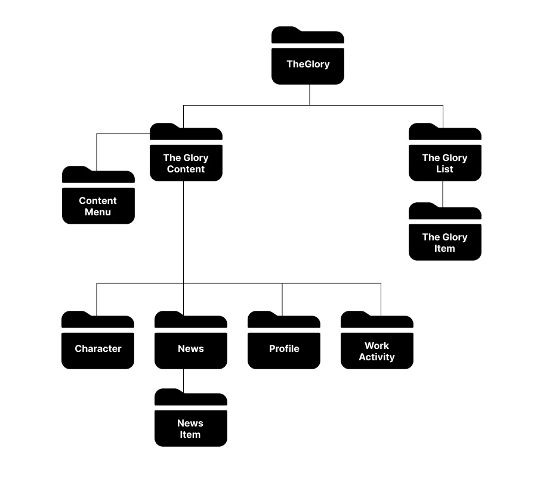

# the glory character introduction

> React를 이용한 더 글로리 인물소개입니다  
> [바로가기](https://chugyeong.github.io/toy-project/the-glory/build/)를 통하여 접속하실 수 있습니다.

<br>

## 1. 사용기술

<br>

-  React
-  SCSS

<br>

## 2. 컴포넌트 분리 구조

<br>



<br>

## 3. 시연 영상

<br>


<br>

## 4. 핵심 기능

<br>

<details>
<summary>데이터 로딩 &#128204;</summary>
<div markdown="1">

<br>

```js
import dataList from '../assets/api/dataList';
const [data, setData] = useState(dataList);
```

-  페이지가 로드될 때, "dataList"라는 데이터를 가져와서 초기 데이터로 설정합니다.
-  이 데이터에는 캐릭터 정보, 프로필 정보, 작품 활동 정보, 관련 뉴스 정보 등이 포함됩니다.

</div>
</details>

<details>
<summary>목록 항목 선택 및 선택 항목 표시 &#128204;</summary>
<div markdown="1">

<br>

```js
const onShow = id => {
   setData(data.map(item => (item.id === id ? { ...item, isChk: true } : { ...item, isChk: false })));
};

const TheGloryItem = ({ item, onShow }) => {
   const { id, name, imgUrl, isChk } = item;
   return (
      <li
         data-id={id}
         className={isChk ? 'on' : ''}
         onClick={() => {
            onShow(id);
         }}>
         <div className="imgBox">
            
         </div>
         <p>{name}</p>
      </li>
   );
};
```

-  이 컴포넌트는 각 아이템에 대한 리스트 아이템을 렌더링하고, 선택한 아이템에 대해 isChk 값을 설정하여 스타일을 변경할 수 있습니다.
-  사용자가 아이템을 클릭하면 onShow 함수가 호출되어 선택한 아이템을 동적으로 표시합니다.

</div>
</details>

<details>
<summary>선택 메뉴 콘텐츠 표시 &#128204;</summary>
<div markdown="1">

<br>

```js
const TheGloryContent = ({ data }) => {
   const [menus, setMenus] = useState([
      { title: '캐릭터소개', isChk: true },
      { title: '프로필', isChk: false },
      { title: '작품활동', isChk: false },
      { title: '관련뉴스', isChk: false },
   ]);

   const onMenu = title => {
      setMenus(menus.map(item => (item.title === title ? { ...item, isChk: true } : { ...item, isChk: false })));
   };

   useEffect(() => {
      setMenus(menus.map(item => (item.title === '캐릭터소개' ? { ...item, isChk: true } : { ...item, isChk: false })));
      return;
   }, [data]);

   return (
      <div className="content">
         <ContentMenu menus={menus} onMenu={onMenu} />
         {menus[0].isChk && <Character data={data} />}
         {menus[1].isChk && <Profile profile={data.profile} />}
         {menus[2].isChk && <WorkActivity workActivity={data.workActivity} />}
         {menus[3].isChk && <News news={data.news} />}
      </div>
   );
};
```

-  이 컴포넌트는 여러 개의 탭을 가진 콘텐츠 영역을 렌더링하여 사용자가 다양한 콘텐츠 섹션 간에 전환할 수 있게 합니다. 아래는 코드의 기능에 대한 설명입니다.
   -  컴포넌트 내에서 menus라는 상태 변수를 선언합니다. 이 변수는 메뉴 아이템의 배열을 저장합니다. 각 메뉴 아이템은 title과 현재 선택된지 여부를 나타내는 isChk 속성을 가지고 있습니다.
   -  onMenu 함수는 메뉴 아이템 클릭을 처리하기 위해 정의됩니다. 메뉴 아이템이 클릭되면 menus 상태를 업데이트하여 선택된 항목을 반영합니다.
   -  useEffect 훅은 data prop이 변경될 때 초기 선택된 메뉴 아이템을 "캐릭터소개"로 설정하기 위해 사용됩니다.
   -  컴포넌트는 "content"라는 클래스 이름을 가진 div 요소를 렌더링합니다.
   -  ContentMenu 컴포넌트를 렌더링하고 menus 상태와 onMenu 함수를 prop으로 전달합니다.
   -  선택된 메뉴 항목에 따라 콘텐츠를 조건부로 렌더링합니다. 각 콘텐츠 섹션(Character, Profile, WorkActivity, News)은 data prop에서 관련 데이터를 받습니다.
   -  렌더링된 콘텐츠 섹션은 menus 상태의 각 메뉴 아이템의 isChk 속성에 따라 결정됩니다.

</div>
</details>

<br>

## 5. 프로젝트 목적

<br>

"더 글로리" 프로젝트의 목적은 사용자에게 프로젝트와 관련된 콘텐츠를 시각적으로 보여주고, 사용자가 콘텐츠를 탐색하고 이해할 수 있는 인터페이스를 제공하는 것입니다.  
페이지는 프로젝트의 주요 기능과 데이터를 시연하며, 사용자에게 프로젝트에 대한 정보를 전달하는 역할을 합니다.  
사용자는 이 페이지를 방문하여 프로젝트의 콘텐츠를 살펴보고 탐색할 수 있으며, 프로젝트에 대한 자세한 정보를 얻을 수 있습니다.
