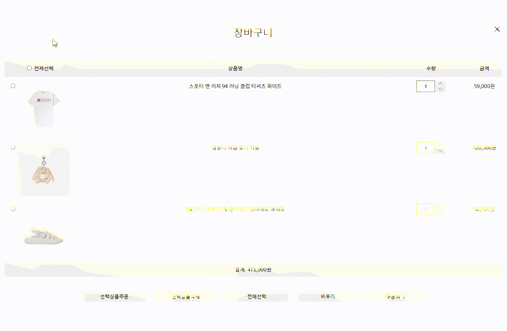

# the glory character introduction

<br>

> Vanilla JS를 이용한 쇼핑몰입니다.  
> [바로가기](https://chugyeong.github.io/toy-project/shopping-basket/)를 통하여 접속하실 수 있습니다.  
> 디자인 및 이미지 참고 [크림](https://kream.co.kr/search)

<br>

## 1. 사용기술

<br>

-  HTML
-  CSS
-  Vanilla JS

<br>

## 2. 상품 정보 데이터

<br>

```js
   let productList = [
      {
         id: 1,
         brand: 'UGG',
         engName: `(W) UGG Sport Yeah Slide Bright White`,
         korName: '(W) 어그 스포츠 예 슬라이드 브라이트 화이트',
         price: 92000,
         quantity: 10,
         imgSrc: './img/item_img_01.png',
      },
      {
         id: 2,
         brand: 'Glowny',
         engName: `Glowny I'm Lony Keyring`,
         korName: '글로니 아임 로니 키링',
         price: 320000,
         quantity: 3,
         imgSrc: './img/item_img_02.jpg',
      },

      ...,

      {
         id: 40,
         brand: 'Adidas',
         engName: `(W) Adidas Gazelle Indoor Pulse Mint Solar Orange`,
         korName: '(W) 아디다스 가젤 인도어 펄스 민트 솔라 오렌지',
         price: 210000,
         quantity: 2,
         imgSrc: './img/item_img_40.png',
      },
   ];

```

<br>

## 3. 미리보기

<br>




<br>

## 4. 핵심 기능

<br>

> 자세한 코드는 [바로가기](https://github.com/ChuGyeong/toy-project/blob/main/shopping-basket/js/main.js) 를 통하여 확인할 수 있습니다.

<br>

<details>
<summary>상품 리스트 출력 및 더보기 버튼 &#128204;</summary>
<div markdown="1">

<br>

```js

//상품 리스트 출력
let moreCnt = 8;

const makeProductList = () => {
   itemListBox.innerHTML = '';
   for (let i = 0; i < moreCnt; i++) {
      itemList = document.createElement('li');
      itemImg = document.createElement('img');
      itemTitle = document.createElement('div');
      itemBrand = document.createElement('p');

      if (productList[i].quantity === 0) {
         itemQuantity.innerHTML = `<span>sold out<span>`;
         itemImg.style.opacity = '0.3';
         itemPrice.textContent = '-';
      } else {
         itemQuantity.innerHTML = `남은 수량: <span>${productList[i].quantity}</span>`;
         itemImg.style.opacity = '1';
         itemPrice.textContent = `${productList[i].price.toLocaleString()}원`;
      }
      btnWish = document.createElement('button');
      btnWish.textContent = '장바구니 담기';

      ...

      itemImg = getAll('.con-box .item-list li img');
      itemQuantity = getAll('.con-box .item-list li .item-quantity');
      itemPrice = getAll('.con-box .item-list li .item-price');
   }
   btnWishMake();
   if (moreCnt >= productList.length) {
      moreBtn.style.display = 'none';
   }
};

//더보기 버튼
moreBtn.addEventListener('click', e => {
   moreCnt += 8;
   makeProductList();
});
```

-  상품 목록을 생성하는 코드입니다.
-  주어진 productList 배열에 있는 상품 정보를 기반으로 상품 목록을 생성하고 HTML에 추가합니다.
-  상품의 수량이 0인 경우에는 "sold out" 메시지와 함께 품절 처리됩니다.
-  초반 상품 목록 출력은 moreCnt 만큼 실행하며 더보기 버튼 클릭 시 moreCnt 변수를 8 증가시키고 makeProductList() 함수를 호출합니다.

</div>
</details>

---

<details>
<summary>장바구니 담기 버튼 &#128204;</summary>
<div markdown="1">

<br>

```js
// 장바구니 담기 버튼
const btnWishMake = () => {
   btnWish.forEach((btnWish, idx) => {
      btnWish.addEventListener('click', e => {
         if (productList[idx].quantity > 0) {
            popup.classList.add('on');
            body.style.overflow = 'hidden';
            let isInBasket = false,
               currentNum = -1;

            basketList.forEach((basketItem, idx) => {
               if (basketItem.id === Number(e.currentTarget.parentElement.dataset.id)) {
                  isInBasket = true;
                  currentNum = idx;
               }
            });
            //장바구니 리스트에 동일한 제품이 있다면 수량 증가
            if (isInBasket) {
               basketList[currentNum].quantity += 1;
               //없다면 배열에 추가
            } else {
               basketList.push({
                  id: productList[idx].id,
                  name: productList[idx].korName,
                  price: productList[idx].price,
                  imgSrc: productList[idx].imgSrc,
                  quantity: 1,
               });
            }
            //상품 리스트 수량 변경
            productList[idx].quantity = productList[idx].quantity - 1;
            if (productList[idx].quantity === 0) {
               itemQuantity[idx].innerHTML = `<span>sold out<span>`;
               itemImg[idx].style.opacity = '0.3';
               itemPrice[idx].textContent = '-';
            } else {
               itemQuantity[idx].innerHTML = `남은 수량: <span>${productList[idx].quantity}</span>`;
               itemImg[idx].style.opacity = '1';
               itemPrice[idx].textContent = `${productList[idx].price.toLocaleString()}원`;
            }
            makeBasketList();
            basketWishNum();
         }
      });
   });
};
```

-  장바구니 담기 버튼 클릭시 상품의 수량이 0보다 큰지 확인합니다.
-  팝업 창에 'on' 클래스를 추가하고, body 요소의 overflow 스타일을 'hidden'으로 설정하여 스크롤을 막습니다.
-  장바구니 목록(basketList)에서 동일한 제품이 있는지 확인 후 동일한 제품이 있다면 isInBasket 변수를 true로 설정하고, 해당 제품의 인덱스를 currentNum 변수에 저장합니다.
-  장바구니 목록에 동일한 제품이 있다면 수량을 증가시킵니다. 없다면 새로운 객체를 basketList에 추가합니다.
-  상품 리스트(productList)에서 선택된 제품의 수량을 1 감소시킵니다. 수량이 0이 되었다면 해당 상품은 품절된 것으로 표시합니다.

</div>
</details>

---

<details>
<summary>장바구니 출력 &#128204;</summary>
<div markdown="1">

<br>

```js
   const makeBasketList = () => {
      basketTable.innerHTML = '';
      basketAllCheck.checked = false;
      // 장바구니 아이템 출력
      basketList.forEach(basketItem => {
         basketTableTr = document.createElement('tr');
         basketTableTd1 = document.createElement('td');
         basketItemCheck = document.createElement('input');
         basketItemImg = document.createElement('img');
         basketTableTd2 = document.createElement('td');

        ...

         basketItemName.textContent = basketItem.name;
         basketItemPrice.textContent = `${(basketItem.price * basketItem.quantity).toLocaleString()}원`;
         basketItemQuantity.value = basketItem.quantity;

         basketTableTd4.append(basketItemPrice);
         basketTableTr.append(basketTableTd1, basketTableTd2, basketTableTd3, basketTableTd4);
         basketTable.append(basketTableTr);

         // 장바구니 상품 체크 박스
         basketItemCheck = getAll('.con-box .basket .basket-list tr td input[type="checkbox"]');
         basketItemQuantity = getAll('.con-box .basket .basket-list tr td .basket-item-quantity input');
         basketQuantityUpBtn = getAll(
            '.con-box .basket .basket-list tr td .basket-item-quantity .btn-up-down button:nth-child(1)',
         );
         basketQuantityDownBtn = getAll(
            '.con-box .basket .basket-list tr td .basket-item-quantity .btn-up-down button:nth-child(2)',
         );
      });

      if (basketList.length) {
         //장바구니 합계
         let basketItemSum = 0;
         for (let i = 0; i < basketList.length; i++) {
            basketItemSum += Number(basketList[i].price) * Number(basketList[i].quantity);
         }
         basketItemTotal.textContent = `합계: ${basketItemSum.toLocaleString()}원`;
      } else {
         basketItemTotal.textContent = '';
      }
      qttUpDownBtn();
      quantityNum();
   };
```

-  장바구니 목록을 표시하기 위해 HTML 요소들을 동적으로 생성합니다. (tr, td, input, img, p 등)
-  만약 basketList에 상품이 존재한다면, 다음 작업을 수행합니다
   -  장바구니의 총 가격을 계산하기 위해 basketList의 모든 상품의 가격을 합산합니다.
   -  계산된 총 가격을 적절한 요소에 텍스트로 표시합니다. (예: "합계: 10,000원")
-  만약 basketList에 상품이 존재하지 않는다면, 총 가격을 나타내는 요소의 텍스트를 비웁니다.

</div>
</details>

---

<details>
<summary>장바구니 아이템 수량 증가/감소 버튼 &#128204;</summary>
<div markdown="1">

<br>

```js
   const qttUpDownBtn = () => {
      //수량 증가 버튼
      basketQuantityUpBtn.forEach((upBtn, idx) => {
         upBtn.addEventListener('click', e => {
            productList.forEach(item => {
               //데이터 id 비교
               if (item.id === Number(basketItemCheck[idx].dataset.id)) {
                  if (item.quantity !== 0) {
                     //상품리스트 배열 수량 감소
                     item.quantity = item.quantity - 1;
                     basketItemQuantity[idx].value = Number(basketItemQuantity[idx].value) + 1;
                     basketList.forEach(basketItem => {
                        //장바구니 배열 수량 증가
                        if (item.id === basketItem.id) {
                           basketItem.quantity = Number(basketItem.quantity) + 1;
                        }
                     });
                  }
               }
            });
            makeProductList();
            makeBasketList();
         });
      });

      //수량 감소 버튼
      basketQuantityDownBtn.forEach((DownBtn, idx) => {
      ...
      });
   };
```

-  함수가 호출되면 basketQuantityUpBtn에 대해 반복문을 실행, 각 버튼에 클릭 이벤트를 추가합니다.
-  클릭 이벤트가 발생하면 다음 작업을 수행합니다
   -  productList 배열을 반복하여 데이터 id를 비교합니다.
   -  선택된 상품과 일치하는 상품을 찾습니다.
   -  만약 해당 상품의 수량이 0이 아니라면, 다음 작업을 수행합니다:
   -  상품 리스트 배열의 수량을 1 감소시킵니다.
   -  장바구니 목록을 반복하여 선택된 상품과 일치하는 상품을 찾고, 해당 상품의 수량을 1 증가시킵니다.
-  makeProductList, makeBasketList 함수를 호출하여 상품 리스트와 장바구니 목록을 업데이트 하고 basketQuantityDownBtn에 대해서도 동일한 작업을 실행합니다. 다만, 수량이 1보다 큰 경우에만 감소하도록 체크합니다.
</div>
</details>

---

<details>
<summary>장바구니 수량 입력 상자 &#128204;</summary>
<div markdown="1">

<br>

```js
const quantityNum = () => {
   const changeQtt = (qtt, idx) => {
      productList.forEach(item => {
         if (item.id === Number(basketItemCheck[idx].dataset.id)) {
            basketList.forEach(basketItem => {
               if (item.id === basketItem.id) {
                  //범위값 초과일 때
                  if (Number(qtt.value) > basketItem.quantity + item.quantity) {
                     qtt.value = basketItem.quantity + item.quantity;
                     item.quantity = 0; //원본배열
                     basketItem.quantity = Number(qtt.value); //장바구니 배열 수량 = input 값
                     //범위값 미만일 때
                  } else if (Number(qtt.value) <= 0) {
                     item.quantity = basketItem.quantity + item.quantity - 1;
                     qtt.value = 1;
                     basketItem.quantity = Number(qtt.value);
                     //정상 범위
                  } else {
                     item.quantity += basketItem.quantity - Number(qtt.value);
                     basketItem.quantity = Number(qtt.value);
                  }
               }
            });
         }
      });
      makeProductList();
      makeBasketList();
      basketWishNum();
   };
   basketItemQuantity.forEach((qtt, idx) => {
      qtt.addEventListener('blur', e => {
         changeQtt(qtt, idx);
      });
      qtt.addEventListener('keydown', e => {
         if (e.keyCode === 13) {
            changeQtt(qtt, idx);
         }
      });
   });
};
```

-  blur 이벤트 또는 엔터 키가 눌렸을 때 다음 작업을 수행합니다
-  changeQtt 함수를 호출하여 수량 변경 작업을 처리합니다. changeQtt 함수는 입력 상자와 해당 상자의 인덱스를 매개변수로 받습니다.
-  changeQtt 함수에서는 다음 작업을 수행합니다
   -  productList 배열을 반복하여 데이터 id를 비교합니다.
   -  선택된 상품과 일치하는 상품을 찾습니다.
   -  해당 상품과 일치하는 장바구니 상품을 찾습니다.
   -  입력 상자의 값과 범위를 비교하여 수량을 조정합니다
   -  입력 상자의 값이 장바구니 상품의 수량과 상품의 수량을 초과하는 경우, 입력 상자의 값을 장바구니 상품의 수량과 상품의 수량의 합으로 설정하고 상품의 수량을 0으로 설정합니다.
   -  입력 상자의 값이 0보다 작거나 같은 경우, 입력 상자의 값을 1로 설정하고 상품의 수량을 장바구니 상품의 수량과 상품의 수량의 합에서 1을 뺀 값으로 설정합니다.
   -  그 외의 경우, 상품의 수량을 장바구니 상품의 수량과 입력 상자의 값의 차이로 설정합니다.

</div>
</details>

---

<details>
<summary>장바구니 선택 삭제 버튼 &#128204;</summary>
<div markdown="1">

<br>

```js
//장바구니 선택 상품 삭제
deleteSelectedProductBtn.addEventListener('click', e => {
   basketItemCheck.forEach(CheckItem => {
      if (CheckItem.checked) {
         const selectedProductId = Number(CheckItem.dataset.id);
         let selectedProductQuantity = 0;

         // 선택된 상품의 수량을 가져오고, 장바구니에서 제거
         basketList = basketList.filter(basketItem => {
            if (basketItem.id === selectedProductId) {
               selectedProductQuantity = basketItem.quantity;
               return false; // 해당 상품을 제거하기 위해 false를 반환
            }
            return true; // 그 외의 상품은 유지하기 위해 true를 반환
         });

         // productList 배열에서 선택된 상품의 수량을 되돌리기
         productList.forEach(item => {
            if (item.id === selectedProductId) {
               item.quantity += selectedProductQuantity;
            }
         });
         makeProductList();
         makeBasketList();
         basketWishNum();
      }
   });
});
```

-  선택 상품 삭제 버튼을 누르면 basketItemCheck를 반복하여 선택된 항목을 찾습니다.
-  만약 해당 항목이 체크되어 있다면 다음 작업을 수행합니다.
   -  CheckItem의 dataset.id를 가져와 selectedProductId로 저장합니다.
   -  selectedProductQuantity 변수를 초기화합니다.
-  basketList 배열에서 선택된 상품을 제거합니다. 이때 선택된 상품의 수량을 selectedProductQuantity에 저장합니다.
   -  filter 메서드를 사용하여 basketList 배열을 순회하면서 선택된 상품과 일치하는 항목을 제거합니다. 이때 filter 함수의 반환 값이 false인 항목은 제거됩니다. 따라서 선택된 상품의 경우 false를 반환하여 제거합니다.
   -  선택된 상품을 제거하고 남은 항목은 true를 반환하여 유지합니다.
-  productList 배열에서 선택된 상품의 수량을 복원합니다.
   -  productList 배열을 순회하면서 선택된 상품과 일치하는 항목을 찾습니다. 일치하는 항목의 수량에 selectedProductQuantity를 더하여 복원합니다.

</div>
</details>

---

<br>

## 5. 프로젝트 목적

<br>

이 프로젝트의 목적은 온라인 상점의 장바구니 및 주문 시스템을 구현하는 것입니다. 이를 통해 사용자는 다음과 같은 기능을 이용할 수 있습니다.

1. 상품 선택 및 장바구니 관리
   -  사용자는 원하는 상품을 선택하여 장바구니에 담을 수 있습니다. 선택된 상품의 수량을 조절하고, 장바구니에서 특정 상품을 제거할 수도 있습니다. 장바구니는 사용자가 상품을 보관하고 나중에 주문하기 위한 임시 저장소 역할을 합니다.
2. 상품 주문 및 주문 정보 확인
   -  사용자가 원하는 상품을 선택하고 주문 시트에 추가할 수 있습니다. 주문 시트는 사용자가 실제로 구매하려는 상품들의 목록을 보여줍니다. 사용자는 주문 시트를 확인하고 주문을 최종적으로 완료할 수 있습니다.
3. 상품 수량 조절 및 동기화
   -  사용자는 장바구니나 주문 시트에서 상품의 수량을 조절할 수 있습니다. 수량을 증가시키거나 감소시키는 버튼을 통해 상품 수량을 조작할 수 있습니다. 장바구니와 주문 시트는 상호간에 동기화되어야 하므로, 수량 조절은 양쪽에서 일관되게 반영되어야 합니다.
4. 결제 및 주문 완료
   -  최종적으로 사용자는 주문을 완료하고 상품을 결제할 수 있습니다. 주문 정보와 결제 방법을 입력하고 확인한 후, 주문이 완료됩니다.

이러한 장바구니 및 주문 시스템은 온라인 상점에서 사용자들이 편리하게 상품을 선택하고 주문하는 데에 필요한 기능입니다. 사용자는 여러 상품을 한꺼번에 장바구니에 넣어두고 필요할 때 주문할 수 있으며, 상품의 수량을 유연하게 조절할 수 있어 편의성이 높아집니다. 또한, 장바구니와 주문 시트 간의 동기화는 사용자가 실시간으로 상품의 수량 변화를 확인할 수 있도록 도와줍니다.
