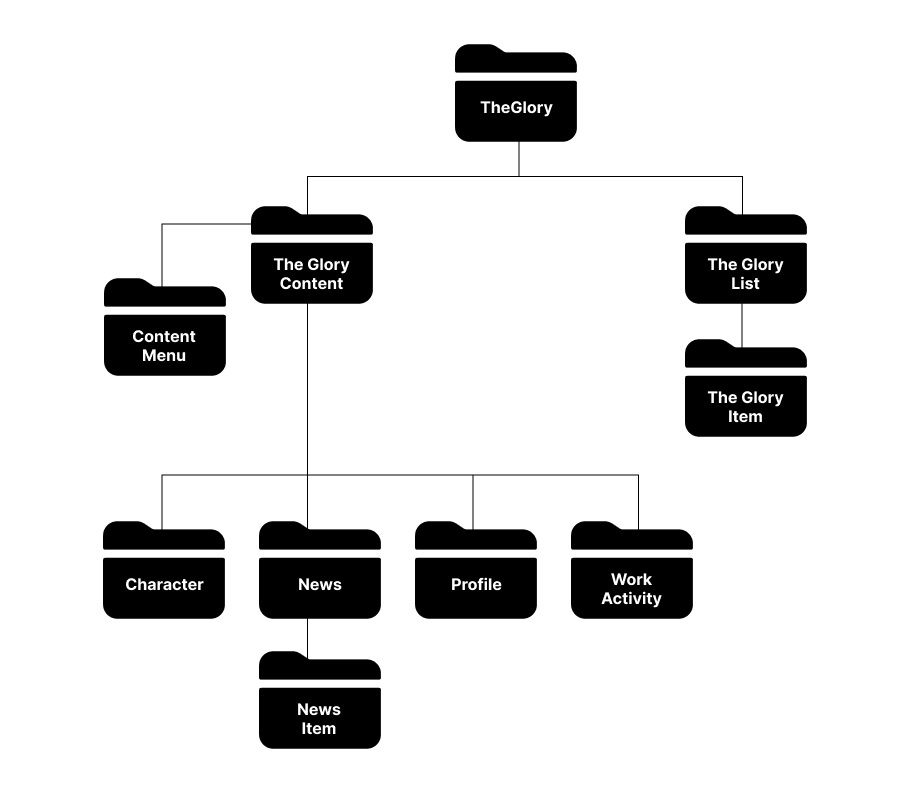

# the glory character introduction

> React를 이용한 더 글로리 인물소개입니다  
> [바로가기](https://chugyeong.github.io/toy-project/the-glory/build/)를 통하여 접속하실 수 있습니다.

 

## 1. 사용기술

-  React
-  SCSS

 

## 2. 컴포넌트 분리 구조

 

## 3. 시연 영상

 

## 4. 핵심 기능

상세설명 접기/펼치기

 

### 데이터 로딩

-  페이지가 로드될 때, "dataList"라는 데이터를 가져와서 초기 데이터로 설정합니다.
-  이 데이터에는 캐릭터 정보, 프로필 정보, 작품 활동 정보, 관련 뉴스 정보 등이 포함됩니다.

### 목록 항목 선택

-  사용자는 "TheGloryList" 컴포넌트에서 제공되는 목록 항목을 클릭하여 원하는 콘텐츠를 선택할 수 있습니다.
-  각 항목은 고유한 식별자(ID)를 가지고 있습니다.

### 선택된 항목 표시

-  사용자가 항목을 선택하면 해당 항목의 "isChk" 속성이 true로 설정됩니다.
-  이를 통해 선택된 항목을 표시하고, 나머지 항목들은 선택되지 않은 상태로 유지됩니다.

### 콘텐츠 표시

-  선택된 항목에 따라 "TheGloryContent" 컴포넌트에서 해당 항목에 맞는 섹션을 표시합니다.
-  예를 들어, "캐릭터 소개" 항목이 선택된 경우 "Character" 컴포넌트가 해당 캐릭터의 정보와 이미지를 표시합니다.
-  선택된 항목에 따라 다른 섹션 컴포넌트가 동적으로 렌더링됩니다.

### 메뉴 탐색

-  사용자는 콘텐츠 섹션 간에 이동하기 위해 메뉴를 사용할 수 있습니다.
-  각 메뉴 항목은 해당 섹션을 표시하도록 설정되며, 사용자가 메뉴를 클릭하면 선택된 섹션으로 전환됩니다.

### 데이터 업데이트

-  "TheGloryContent" 컴포넌트에서 선택된 항목과 관련된 데이터를 동적으로 업데이트합니다.
-  예를 들어, 선택된 캐릭터의 정보를 표시하기 위해 해당 캐릭터에 대한 데이터를 사용합니다.

### 상태 업데이트

-  사용자는 "TheGloryList" 컴포넌트에서 항목을 선택할 때마다 상태가 업데이트됩니다.
-  선택된 항목의 ID를 기반으로 데이터의 상태를 변경합니다.
-  선택된 항목은 "isChk" 속성을 통해 표시되며, 나머지 항목은 선택되지 않은 상태로 유지됩니다.

### 자동 초기화

-  "TheGloryContent" 컴포넌트는 선택된 항목에 따라 해당 콘텐츠를 표시합니다.
-  그러나 사용자가 다른 항목을 선택할 때마다 이전에 선택된 항목은 자동으로 초기화됩니다.
-  이를 통해 사용자는 항상 선택한 항목에 대한 콘텐츠를 볼 수 있습니다.

 

## 5. 프로젝트 목적

"더 글로리" 프로젝트의 목적은 사용자에게 프로젝트와 관련된 콘텐츠를 시각적으로 보여주고, 사용자가 콘텐츠를 탐색하고 이해할 수 있는 인터페이스를 제공하는 것입니다.  
페이지는 프로젝트의 주요 기능과 데이터를 시연하며, 사용자에게 프로젝트에 대한 정보를 전달하는 역할을 합니다.  
사용자는 이 페이지를 방문하여 프로젝트의 콘텐츠를 살펴보고 탐색할 수 있으며, 프로젝트에 대한 자세한 정보를 얻을 수 있습니다.
