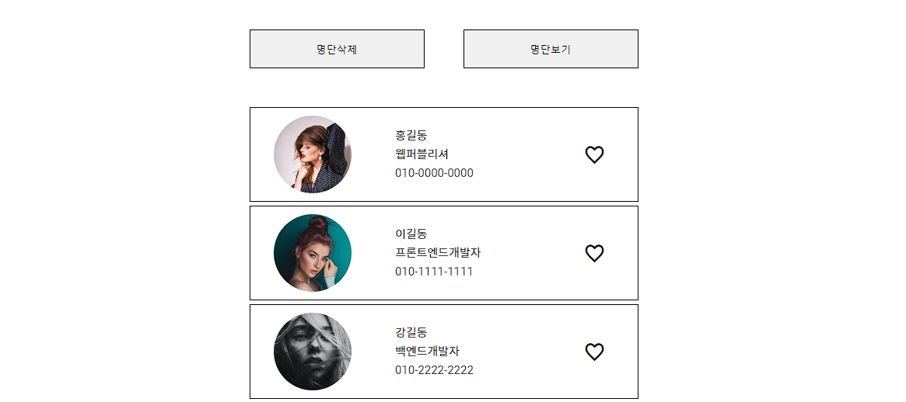
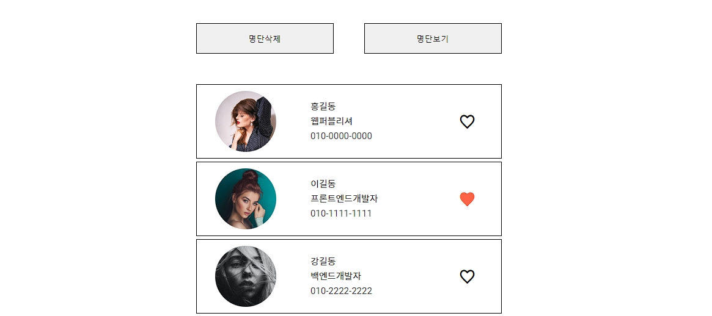
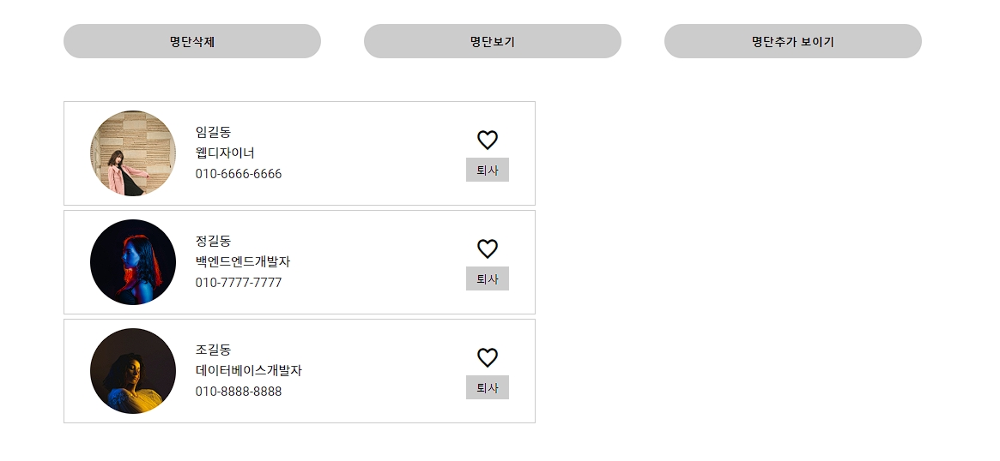
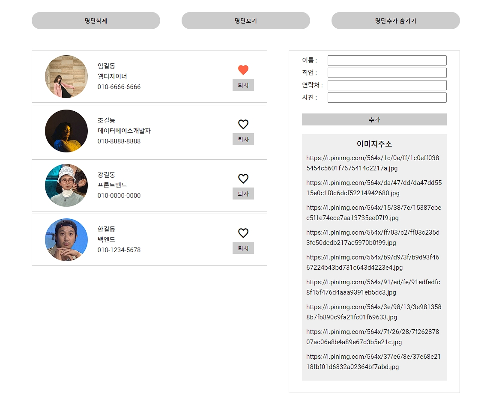
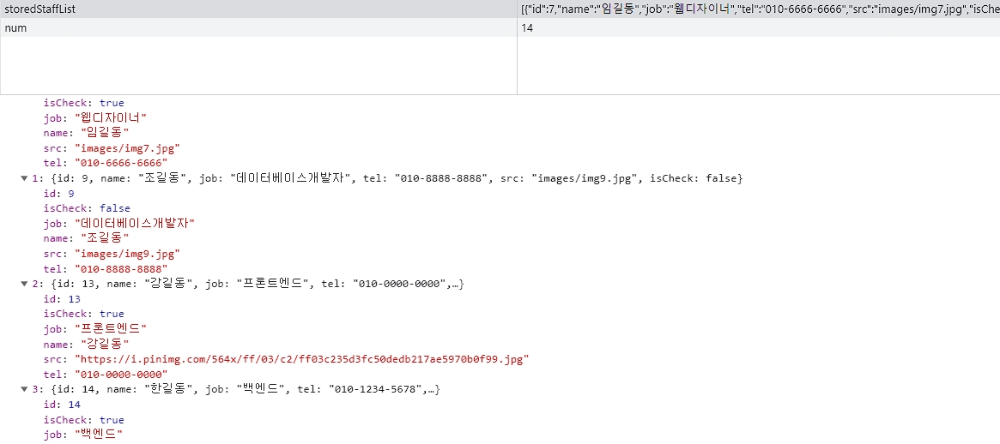

# **staffList (모듈 연습)**

## module

모듈화는 코드를 독립적인 단위로 분리하여 조직화하는 프로그래밍 개념입니다.<br>
모듈은 관련 있는 함수, 변수, 클래스 등을 그룹화하여 하나의 단위로 만듭니다.<br>
<br>
모듈을 사용하는 것에는 다음과 같은 장점이 있습니다<br>

1. 네임스페이스 분리
2. 코드 재사용
3. 의존성 관리
4. 코드 유지보수성 향상
5. 코드의 가독성과 유지보수성 개선
6. 코드 범위 제한
   <br>
   <br>

```js
<script type="module" src="./경로js"></script>

//모듈 .js 내보내기
export const 변수 = 값
export function 함수명() {}
export const 객체 = {}
export class 클래스명 {}

//모듈 js. 가져오기
import { 변수, 함수, 객체, 클래스 } from '경로/파일명.js'
import * as 별칭 from '경로/파일명.js'

//default
//default 로 내보낸 것은 {} 를 사용할수 없으며 하나의 js 파일에서 단 한번만 사용할 수 있습니다
export default 함수
export default 객체
export default 클래스
```

## 1. **step1**




```js
 let peopleList = [
            { name: '홍길동', job: '웹퍼블리셔', tel: '010-0000-0000', src: 'images/img1.jpg' },
            { name: '이길동', job: '프론트엔드개발자', tel: '010-1111-1111', src: 'images/img2.jpg' },
            { name: '강길동', job: '백엔드개발자', tel: '010-2222-2222', src: 'images/img3.jpg' },
            { name: '박길동', job: '데이터베이스개발자', tel: '010-3333-3333', src: 'images/img4.jpg' },
            ... ]
```

peopleList 변수에 사람들의 정보를 객체 배열 형태로 저장합니다.

```js
function showList() {
   peopleList.map(item => {
      list.innerHTML += `
              <li>
               <div class="img-box"></div>
               <div class="txt-box">
                  <p>${item.name}</p>
                  <p>${item.job}</p>
                  <p>${item.tel}</p>
               </div>
               <button class="like-btn"><i class="xi-heart-o"></i></button>
            </li>
              `;
      likeBtn = document.querySelectorAll('.con-box .list .like-btn');
   });
   likeBtnMake();
}
```

showList 함수는 peopleList 배열의 각 요소를 순회하며 HTML 목록에 표시합니다.
<br>
각 사람의 정보를 사용하여 목록 아이템을 동적으로 생성하고, 좋아요 버튼에 이벤트 리스너를 추가합니다.
<br>
생성된 좋아요 버튼은 likeBtn 변수에 저장됩니다.
<br>
likeBtnMake 함수를 호출하여 좋아요 버튼에 대한 이벤트 리스너를 등록합니다.

```js
deletebtn.addEventListener('click', e => {
   list.innerHTML = '';
});
viewBtn.addEventListener('click', e => {
   list.innerHTML = '';
   showList();
});
```

명단삭제
<br>
deleteBtn 버튼에 'click' 이벤트 리스너를 추가하여, 목록을 비웁니다.
<br>
명단 보기
<br>
viewBtn 버튼에 'click' 이벤트 리스너를 추가하여, 목록을 비우고 다시 보여줍니다.
<br>
showList 함수를 호출하여 목록을 보여줍니다.

```js
function likeBtnMake() {
   likeBtn.forEach(item => {
      let isHeart = true;
      item.addEventListener('click', e => {
         if (isHeart) {
            item.children[0].classList.replace('xi-heart-o', 'xi-heart');
            item.children[0].style.color = 'tomato';
         } else {
            item.children[0].classList.replace('xi-heart', 'xi-heart-o');
            item.children[0].style.color = 'black';
         }
         isHeart = !isHeart;
      });
   });
}
```

likeBtnMake 함수는 각 좋아요 버튼을 클릭할 때마다, 하트 아이콘과 색상이 변경됩니다.
<br>
isHeart 변수를 사용하여 현재 상태를 추적하고 변경합니다.

## 2. **step2**

-  모듈화 ver1

```js
      <script type="module">
         import { peopleList } from './module/data.js';
```

-  2-1. 모듈가져오기
   <br>
   import { peopleList } from './module/data.js';를 사용하여 data.js 모듈에서 peopleList 변수를 가져옵니다.
   <br>
   data.js 파일에는 peopleList 변수에 대한 초기 데이터 설정이 포함되어 있습니다.
   <br>

-  2-2. type="module" 속성
   <br>
   script 태그에 type="module" 속성이 추가되어 모듈로써의 JavaScript 코드를 사용할 수 있도록 합니다.

## 3. **step3**

-  모듈화 ver2

```js
<script type="module" src="app.js"></script>
```

-  3-1. 외부 JavaScript 파일 가져오기
   <br>
   script 태그의 src 속성을 사용하여 외부 JavaScript 파일인 app.js를 가져옵니다.
   <br>
   app.js 파일에는 이전에 설명한 JavaScript 코드가 포함되어 있습니다.

```js
import { peopleList } from './module/data.js';
import { showList, likeBtnMake } from './module/showObj.js';
```

-  3-2. 외부 모듈 가져오기
   <br>
   import { peopleList } from './module/data.js'; 코드를 사용하여 data.js 파일에서 peopleList를 가져옵니다.
   <br>
   import { showList, likeBtnMake } from './module/showObj.js'; 코드를 사용하여 showObj.js 파일에서 showList와 likeBtnMake 함수를 가져옵니다.

## 4. **step4**

-  모듈화 ver3

```js
export function get(target) {
   const ele = document.querySelector(target);
   if (ele) {
      return ele;
   } else {
      throw Error('선택한 요소가 존재하지 않습니다');
   }
}
export function getAll(target) {
   const ele = document.querySelectorAll(target);
   if (ele) {
      return ele;
   } else {
      throw Error('선택한 요소가 존재하지 않습니다');
   }
}
```

target 매개변수를 받아서 해당 CSS 선택자에 맞는 첫 번째 요소를 반환합니다.
<br>
요소를 찾으면 해당 요소를 반환하고, 찾지 못하면 에러를 던집니다.

## 5. **step5**

-  기능 추가
   -  명단 추가 보이기/숨기기 btn
      -  토글 기능
   -  이름, 직업, 연락처, 사진을 적고 추가 버튼을 누를 시 리스트에 추가
   -  좋아요 버튼 아래 퇴사 버튼
      -  클릭 시 리스트에서 제거





```js
import { staffList } from './module/data.js';
```

staffList를 ./module/data.js 파일에서 가져옵니다. 이는 사원 목록을 담고 있는 원본 배열입니다.

```js
class Staff {
   init() {
      num = JSON.parse(localStorage.getItem('num')) || staffList.length;
      if (num === staffList.length) {
         localStorage.setItem('storedStaffList', JSON.stringify([...staffList]));
         num++;
         localStorage.setItem('num', num);
      }
      this.show();
      this.event();
   }
```

-  5-1 **init** 메서드
   <br>
   storedStaffList를 로컬 스토리지에서 가져옵니다.
   <br>
   만약 storedStaffList가 존재하지 않으면 기본적으로 staffList를 사용합니다.
   <br>
   또한, num을 로컬 스토리지에서 가져옵니다.
   <br>
   num은 사원 ID를 생성하는 데 사용됩니다.
   <br>
   초기에는 num이 staffList의 길이와 동일한 경우에만 storedStaffList와 num을 로컬 스토리지에 저장합니다.
   <br>
   이후에 show 메서드와 event 메서드를 호출합니다.

```js
   event() {
      hideBtn.addEventListener('click', e => {
         addList.classList.toggle('on');
         if (addList.classList.contains('on')) {
            hideBtn.textContent = '명단추가 숨기기';
         } else {
            hideBtn.textContent = '명단추가 보이기';
         }
      });

      deleteBtn.addEventListener('click', e => {
         list.innerHTML = '';
      });
      viewBtn.addEventListener('click', e => {
         this.show();
      });

      ProfileBox.addEventListener('submit', e => {
         this.add();
         this.show();
         this.txtReset();
      });
   }
```

-  5-2 **event** 메서드
   <br>
   이벤트 리스너를 등록합니다.
   <br>
   hideBtn을 클릭하면 addList의 표시 여부를 토글합니다.
   <br>
   deleteBtn을 클릭하면 list의 내용을 삭제합니다.
   <br>
   viewBtn을 클릭하면 show 메서드를 호출하여 사원 목록을 표시합니다
   <br>
   ProfileBox에 submit 이벤트가 발생하면 add 메서드를 호출하여 새로운 사원을 추가하고, show 메서드를 호출하여 업데이트된 사원 목록을 표시합니다.
   <br>
   마지막으로, txtReset 메서드를 호출하여 입력 필드를 초기화합니다.

```js
 add() {
      if (!ProfileName.value || !ProfileJob.value || !ProfileTel.value || !ProfileImg.value) return;
      num++;
      storedStaffList = [
         ...storedStaffList,
         {
            id: num,
            name: ProfileName.value,
            job: ProfileJob.value,
            tel: ProfileTel.value,
            src: ProfileImg.value,
            isCheck: false,
         },
      ];
      localStorage.setItem('storedStaffList', JSON.stringify(storedStaffList));
      localStorage.setItem('num', num);
   }
```

-  5-3. **add** 메서드
   <br>
   입력 필드에서 값들을 가져와서 새로운 사원을 storedStaffList에 추가합니다.
   <br>
   새로운 사원의 ID는 num을 사용하여 생성되고, isCheck 속성은 기본적으로 false로 설정됩니다.
   <br>
   추가된 storedStaffList를 로컬 스토리지에 저장하고, num을 업데이트하여 다음 사원의 ID를 준비합니다.

```js
   txtReset() {
      ProfileName.value = '';
      ProfileJob.value = '';
      ProfileTel.value = '';
      ProfileImg.value = '';
      ProfileName.focus();
   }
```

-  5-4. **txtReset** 메서드
   <br>
   메서드를 호출하여 입력 필드를 초기화합니다.

```js
show() {
      storedStaffList = JSON.parse(localStorage.getItem('storedStaffList')) || [];
      list.innerHTML = '';
      storedStaffList.forEach(item => {
         const { id, name, job, tel, src, isCheck } = item;
         let li = document.createElement('li');
         let imgBox = document.createElement('div');
         let img = document.createElement('img');
         let txtBox = document.createElement('div');
         let userName = document.createElement('p');
         let userJob = document.createElement('p');
         let userTel = document.createElement('p');
         let btnBox = document.createElement('div');
         let likeBtn = document.createElement('button');
         let likeIcon = document.createElement('i');
         let resignationBtn = document.createElement('button');

         imgBox.classList.add('img-box');
         txtBox.classList.add('txt-box');
         btnBox.classList.add('btn-box');

         img.setAttribute('src', src);
         img.setAttribute('alt', name);
         userName.textContent = name;
         userJob.textContent = job;
         userTel.textContent = tel;

         if (!isCheck) {
            likeIcon.classList.add('xi-heart-o');
            likeIcon.style.color = 'black';
         } else {
            likeIcon.classList.add('xi-heart');
            likeIcon.style.color = 'tomato';
         }
         resignationBtn.textContent = '퇴사';

         likeBtn.append(likeIcon);
         imgBox.append(img);
         txtBox.append(userName, userJob, userTel);
         btnBox.append(likeBtn, resignationBtn);
         li.append(imgBox, txtBox, btnBox);
         list.append(li);
         this.ckeck(likeBtn, isCheck, id);
         this.resignation(resignationBtn, id);
      });
   }
```

-  5-5. **show** 메서드
   <br>
   storedStaffList를 로컬 스토리지에서 가져옵니다.
   <br>
   가져온 storedStaffList를 사용하여 각 사원의 정보를 HTML 요소로 생성하여 list에 추가합니다.
   <br>
   각 사원에 대해 좋아요 버튼과 퇴사 버튼의 이벤트 리스너를 등록합니다.

```js
   resignation(resignationBtn, id) {
      resignationBtn.addEventListener('click', e => {
         storedStaffList = storedStaffList.filter(item => item.id !== id);
         localStorage.setItem('storedStaffList', JSON.stringify(storedStaffList));
         this.show();
      });
   }
```

-  5-6. **resignation** 메서드
   <br>
   퇴사 버튼을 클릭하면 해당 사원을 storedStaffList에서 제거하고, 업데이트된 storedStaffList를 로컬 스토리지에 저장한 후 show 메서드를 호출하여 사원 목록을 업데이트합니다.

```js
   ckeck(likeBtn, isCheck, id) {
      likeBtn.addEventListener('click', e => {
         storedStaffList.map(item => {
            if (item.id === id) {
               item.isCheck = !isCheck;
            }
         });
         localStorage.setItem('storedStaffList', JSON.stringify(storedStaffList));
         this.show();
      });
   }
```

-  5-7. **check** 메서드
   <br>
   좋아요 버튼을 클릭하면 해당 사원의 isCheck 속성을 토글하고, 업데이트된 storedStaffList를 로컬 스토리지에 저장한 후 show 메서드를 호출하여 사원 목록을 업데이트합니다.
