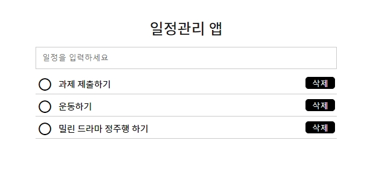
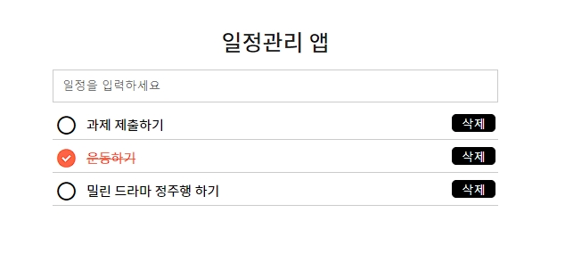
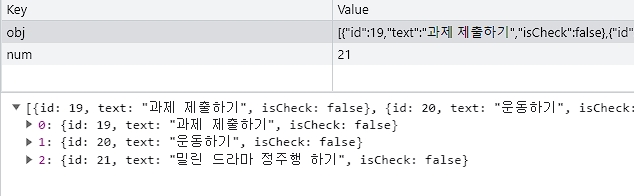

# **ToDoList (로컬스토리지 연습)**

## localStorage

localStorage 속성을 사용하면 Document 출처의 **객체**에 접근할 수 있습니다.<br>
저장한 데이터는 브라우저 세션 간에 공유됩니다.<br>
localStorage는 sessionStorage와 비슷하지만 localStorage의 데이터는 만료되지 않고 sessionStorage의 데이터는 페이지 세션이 끝날 때 사라지는 점이 다릅니다.<br>
<br>
문자값으로 처리되기 때문에 작은따옴표('')와 큰따옴표("")가 필수로 들어가야 합니다.
<br>
<br>

```js
localStorage.setItem('key', 'value'); //추가
localStorage.getItem('key'); //읽기
localStorage.removeItem('key'); //제거
localStorage.clear(); //전체 삭제
```

## 1. **step1**

-  vanilla script 일정관리앱 만들기
-  localStorage 이용





```js
let obj = [];
let num;
const init = () => {
   num = JSON.parse(localStorage.getItem('num')) || 0;
};
```

obj는 할 일 객체들을 저장하는 배열입니다.
<br>
num은 할 일 객체의 고유 ID를 생성하기 위한 변수입니다.
<br>
init 함수는 초기화 작업을 수행합니다. 로컬 스토리지에서 num 값을 가져와 초기화합니다.

```js
toDoList.addEventListener('submit', e => {
   add();
   show();
   txt.value = '';
});
```

toDoList 폼의 제출(submit) 이벤트를 처리하는 함수를 등록합니다.
<br>
add 함수를 호출하여 할 일을 추가하고, show 함수를 호출하여 할 일 목록을 표시하며, 입력 필드를 초기화합니다.

```js
function add() {
   if (txt.value) {
      num++;
      obj = [...obj, { id: num, text: txt.value, isCheck: false }];
      localStorage.setItem('obj', JSON.stringify(obj));
      localStorage.setItem('num', num);
   }
}
```

add 함수는 입력 필드의 값이 있을 경우에만 새로운 할 일 객체를 생성하여 배열에 추가하고 로컬 스토리지에 저장합니다.

```js
function show() {
   obj = JSON.parse(localStorage.getItem('obj')) || [];
   list.innerHTML = '';
   obj.forEach(item => {
      const { id, text, isCheck } = item;
      let li = document.createElement('li');
      let p = document.createElement('p');
      let i = document.createElement('i');
      let deleteBtn = document.createElement('button');
      p.textContent = text;
      if (!isCheck) {
         i.classList.add('xi-radiobox-blank');
         i.style.color = 'black';
         p.style.color = 'black';
         p.style.textDecorationLine = 'none';
      } else {
         i.classList.add('xi-check-circle');
         i.style.color = 'tomato';
         p.style.color = 'tomato';
         p.style.textDecorationLine = 'line-through';
      }
      deleteBtn.textContent = '삭제';
      li.append(i, p, deleteBtn);
      list.append(li);
      delShow(deleteBtn, id);
      ckeck(i, isCheck, id);
   });
}
```

show 함수는 할 일 목록을 표시합니다.
<br>
로컬 스토리지에서 할 일 객체 배열을 가져와 각 할 일을 li 요소로 생성하여 목록에 추가합니다.

```js
function delShow(deleteBtn, id) {
   deleteBtn.addEventListener('click', e => {
      obj = obj.filter(item => item.id !== id);
      localStorage.setItem('obj', JSON.stringify(obj));
      show();
   });
}
```

delShow 함수는 삭제 버튼 클릭 이벤트를 처리합니다.
<br>
클릭된 할 일을 배열에서 제거하고 로컬 스토리지를 업데이트한 후 할 일 목록을 다시 표시합니다.

```js
function ckeck(i, isCheck, id) {
   i.addEventListener('click', e => {
      obj.map(item => {
         if (item.id === id) {
            item.isCheck = !isCheck;
         }
      });
      localStorage.setItem('obj', JSON.stringify(obj));
      show();
   });
}
```

ckeck 함수는 완료 상태 변경 이벤트를 처리합니다.
<br>
할 일을 완료 상태로 변경하거나 취소하고 로컬 스토리지를 업데이트한 후 할 일 목록을 다시 표시합니다.
<br>
<br>
<br>
init 함수와 show 함수를 호출하여 앱을 초기화하고 할 일 목록을 표시합니다.
<br>
<br>
이 코드는 입력 필드에 할 일을 입력하고 엔터를 누르면 할 일이 목록에 추가되며, 목록의 각 항목에는 완료 버튼과 삭제 버튼이 있습니다.
<br>
완료 버튼을 클릭하면 할 일이 완료된 상태로 변경되고 취소하면 색상과 텍스트 스타일이 변경됩니다.
<br>
삭제 버튼을 클릭하면 해당 할 일이 목록에서 제거됩니다.

## 2. **step2**

-  Class 이용
-  코드 구조 변경

```js
class toDo {
   obj = [];
   num;
   init() {
      this.num = JSON.parse(localStorage.getItem('num')) || 0;
      this.show();
      toDoList.addEventListener('submit', e => {
         this.add();
         this.show();
         txt.value = '';
      });
   }
   // 이하 코드 생략
}

const todo = new toDo();
todo.init();
```

이전 코드에서는 함수를 사용하여 기능을 구현하였으나, 새로운 코드에서는 toDo 클래스를 정의하여 객체 지향적인 방식으로 기능을 구현합니다.

## 3. **step3**

-  모듈화

```js
<script type="module" src="./module/app.js"></script>
```

이전에는 스크립트 코드가 직접 포함되어 있었지만, 이번에는 src 속성을 사용하여 외부 모듈 파일인 app.js를 불러옵니다.
<br>
type="module" 속성은 해당 스크립트가 ES6 모듈로 작성되었음을 지정합니다.
<br>
위 코드를 통해 app.js 파일에 작성된 JavaScript 코드가 실행되며, 기존의 스크립트 부분이 모듈화되어 코드의 구조가 개선되었습니다.

```js
export default function (target) {
   const ele = document.querySelector(target);
   if (ele) {
      return ele;
   } else {
      throw Error('get - 선택한 요소가 존재하지 않습니다');
   }
}
```

해당 코드는 JavaScript로 작성된 함수입니다.
<br>
이 함수는 주어진 선택자에 해당하는 요소를 선택하고 반환하는 기능을 가지고 있습니다.
<br>
요소를 찾지 못한 경우, Error를 throw하여 오류 메시지를 표시합니다.
